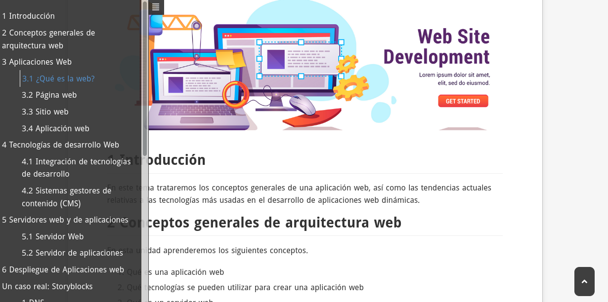

# pandoc-toc-template.html

This templates can be used in conjunction with `pandoc` to generate an HTML page with a autoscrolling TOC menu showed at top-left corner of the page.

## Example

Please scroll down [the sample page](https://victorponz.github.io/symfony-blog-teoria/zona-admin "sample page") to see the toc in action.

#### Screenshot



## Installation

Download `toc-template.html` and copy it into the `pandoc` templates directory, usually (in *nix systems) under `~/.pandoc/templates/` 

> See `pandoc` documentation to install a template in your system. You can type `pandoc -v` to know where is located this templates directory

## usage

Use it just like any other `pandoc` template

**For instance**

```bash
pandoc example.md -o example.html --toc --highlight-style pygments --filter pandoc-latex-environment -s  --template=toc-template.html
```

**Thanks to** [https://github.com/ryangrose/easy-pandoc-templates](https://github.com/ryangrose/easy-pandoc-templates) for his inspiration 


Made with :heart: in [Burriana](https://turisme.burriana.es/)

